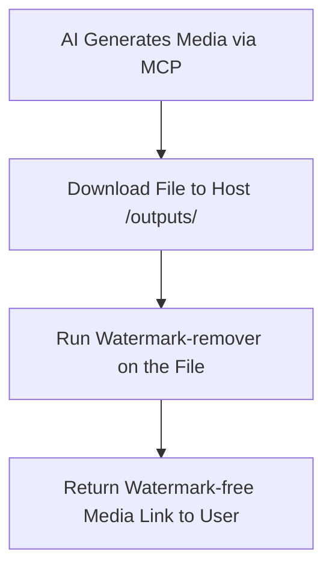

# 🧹 Watermark Cleaner Guide (Watermark-remover)

This guide documents the CLI commands and integration options for **`Watermark-remover`**, a high-performance pre-built binary designed to automatically detect and remove transparent watermarks/logos from AI-generated images and videos.

---

## 🚀 Overview

The `Watermark-remover` tool scans the pixel buffers of images and frames of videos to locate watermarks (such as Imagen or Veo signatures). It then applies a mathematical alpha-gain correction to blend the watermark out of the media seamlessly.

**Binary is bundled inside this skill folder — no Go or compilation needed.**

---

## 💻 CLI Usage

The binary `Watermark-remover` is located **inside this skill's own folder**.

> [!IMPORTANT]
> **Path Resolution:** The binary path is relative to this SKILL.md file's directory.
> Use `<this_skill_dir>/Watermark-remover` where `<this_skill_dir>` is the absolute path of the folder containing this SKILL.md.

### 📋 CLI Arguments
*   `-i <path>`: (Required) Absolute path to the input image, video, or a directory containing multiple files.
*   `-o <path>`: (Optional) Absolute path to save the cleaned output. If omitted, the tool will clean the file and overwrite/save it in the same directory as `cleaned_[original_name]`.
*   `-g <float>`: (Optional) Custom alpha-gain scaling factor. Default is `0.60`. Increase it if the watermark is still slightly visible, or decrease it if the area becomes too dark.

---

## 🛠️ Usage Examples

### 1. Cleaning a Single Image
```bash
<this_skill_dir>/Watermark-remover -i "/path/to/input_image.png" -o "/path/to/cleaned_image.png"
```

### 2. Cleaning a Single Video
```bash
<this_skill_dir>/Watermark-remover -i "/path/to/input_video.mp4" -o "/path/to/cleaned_video.mp4"
```

### 3. Batch Cleaning a Whole Directory
```bash
<this_skill_dir>/Watermark-remover -i "/path/to/outputs/" -o "/path/to/cleaned-outputs/"
```

---

## 🤖 AI Integration Workflow

When generating media using the `gemini` MCP tools (`generate_image` or `generate_video`), the AI agent should automatically execute the clean-up pipeline:



### Auto-Cleanup Command template
```bash
# Generate -> Download -> Clean in one sequence
<this_skill_dir>/Watermark-remover -i "[input_file]" -o "[output_file]"
```
